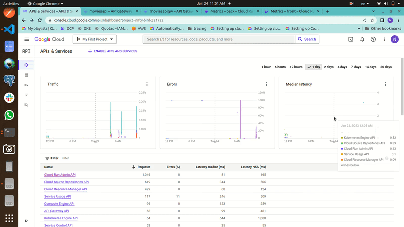

# Google API Gateway with Cloud Run

This is a quick PoC for Google API Gatewy capabilities.

 

### Technology stack:
- Google API Gateway.
- Google Cloud Run.
- Django Rest Framework (DRF) - for backend
- React - for frontend.

 

### Usage

- Build your own image for both front and backend services.
- update run module in terrform/main.tf file with your docker images.
- update terraform//module/apiGateway/swagger_template.yml with your services urls.
- terraform apply.
- Login to the frontend url:
    - Use below credentials:
>       username: admin
>       password: admin
- Make sure your requests are routed through the API Gateway.

 

#### TODO
- Cloudbuild